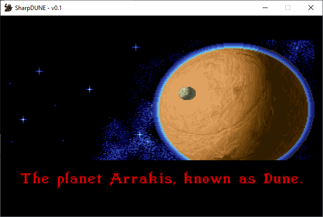
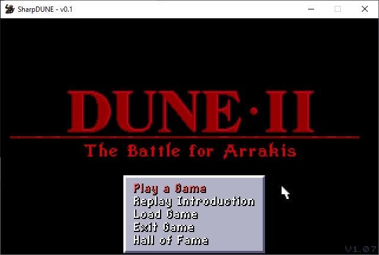
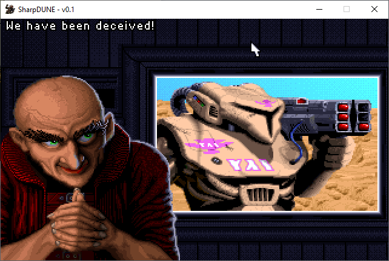
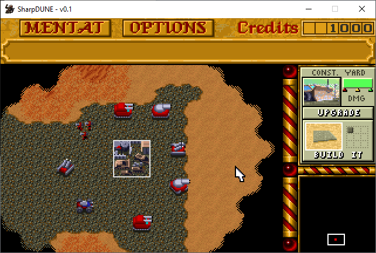
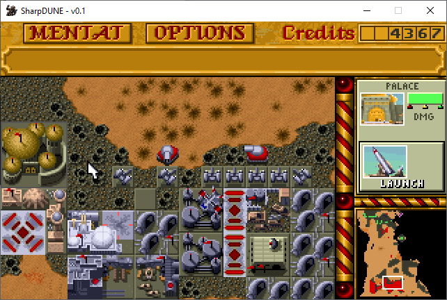
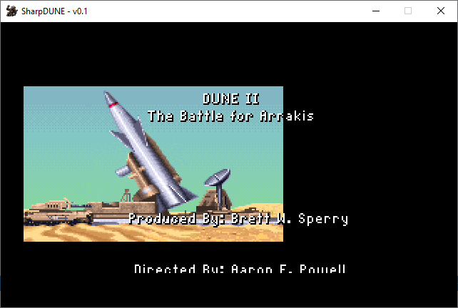

# SharpDune
C# port of the excellent [OpenDUNE](https://github.com/OpenDUNE/OpenDUNE).

In order to run the original game data files need to be present in a folder named "data".

For video [SDL2](https://www.libsdl.org) and [SDL2 Image](https://www.libsdl.org/projects/SDL_image) are required.

For audio (MIDI and WaveOut) winmm.dll is used.

IDE: latest Visual Studio Community 2022 Preview.

WIP.

## Screenshots

Intro:

Main menu:

Mentat:

In-game 1:

In-game 2:

Outro:

