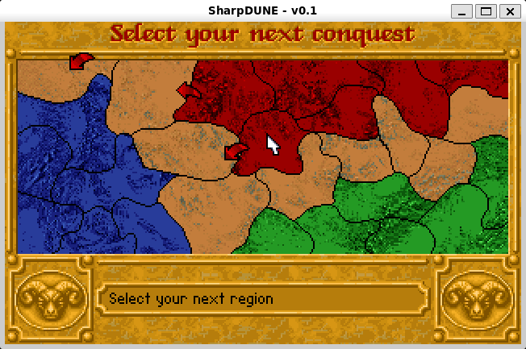

# SharpDune
C# port of the excellent [OpenDUNE](https://github.com/OpenDUNE/OpenDUNE).

In order to run the original game data files need to be present in a folder named `data`.

Running on Windows:
1. Edit paths (`datadir`, `savedir`) in sharpdune.ini
2. Select the `Debug` or `Release` configuration
3. Start SharpDune with the `SharpDune` profile

Running on Linux (WSL 2/WSLg):
1. Edit paths (`datadir`, `savedir`) in sharpdune.ini
2. Select the `DebugWSL` or `ReleaseWSL` configuration
3. Start SharpDune with the `WSL` profile

Graphics: SDL2.

Sound: SDL2/WinMM (Windows), SDL2/PulseAudio/ALSA (Linux).

Music: WinMM (Windows).

IDE: latest Visual Studio Community 2022.

## Screenshots

Intro:

Main menu:

Mentat:

In-game 1:

In-game 2:

Outro:

Strategic map - Linux (WSL 2/WSLg):

